<div align="center">
   <h1> Event Viewer 🏛️ </h1>

   
   
   
   
   
</div>

## 📌 Overview

**Event Viewer** is a template site for a high-performance, hierarchical image archiving system designed for institutions. It provides a state-of-the-art OneDark aesthetic with an interactive particle-driven UI, ensuring official event photography is preserved with departmental precision and administrative oversight.

## 🎯 Objectives

- Organize events into main and sub-events for structured documentation.
- Restrict upload access based on departmental assignments and officer roles.
- Deliver a professional, dark-themed experience with fluid animations and micro-interactions.
- Robust authentication for officers and administrators to manage digital assets.

## 🛠 Features

- **Interactive UI**: Premium particle field background that reacts to mouse movements in real-time, implemented in [`MouseGlow.tsx`](components/MouseGlow.tsx).
- **Hierarchical Events**: Support for Main events and Sub-events with inherited image galleries, managed in [`route.ts`](app/api/events/[id]/images/route.ts).
- **Role-Based Access**: Secure login and permission levels for Admins and Departmental Members.
- **Image Gallery**: Fast, responsive image documentation with metadata and uploader tracking.
- **Mobile Responsive**: Fully optimized layout for all devices using modern CSS variables and flexbox.

## 🎨 Color Palette Reference (OneDark Theme)

| Palette     | Background                                              | Surface                                                 | Accent (Gold)                                           | Text                                                    |
| :---------- | :------------------------------------------------------ | :------------------------------------------------------ | :------------------------------------------------------ | :------------------------------------------------------ |
| **OneDark** |  |  |  |  |

## 📁 Project Structure

```text
.
├── app/                # Next.js App Router (Pages & APIs)
│   ├── admin/          # Administrative dashboards
│   ├── member/         # Officer/Member dashboards
│   ├── api/            # Backend API routes (SQLite interactions)
│   └── globals.css     # Central OneDark Design System
├── components/         # Reusable UI Components
│   ├── MouseGlow.tsx   # Interactive particle engine
│   ├── Navbar.tsx      # Glassmorphic navigation
│   ├── Sidebar.tsx     # Role-based sidebar
│   └── EventCard.tsx   # Premium event display cards
├── lib/                # Database and Auth utilities
└── public/             # Static assets and uploads
```

## 🚀 Working

1. **Authentication**: Officers sign in via the secure login portal to access their dashboard.
2. **Event Creation**: Admins create Main events (e.g., "National Day"). Members can create Sub-events (e.g., "Department Parade") linked to main ones.
3. **Image Archiving**: Authorized officers upload documentation. Main events automatically aggregate images from all nested sub-events.
4. **Public Access**: Citizens can browse public event galleries in a highly performant, visually stunning interface.

## ⚙️ Installation & Usage

### 1 Clone the repository

[](https://git-scm.com/)
[](https://github.com/akshat-jasrotia/event-viewer)

```bash
git clone https://github.com/akshat-jasrotia/event-viewer.git
cd event-viewer
```

### 2 Install dependencies

[](https://nodejs.org/)

```bash
npm install
```

### 3 Run the Application

```bash
npm run dev
```

Open your browser and visit: `http://localhost:3000`

## 📽️ Visuals & Results

### 🏠 Homepage

<p align="center">
  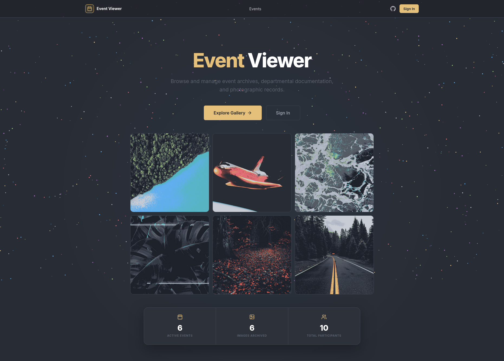
</p>

### 🛡️ Admin Login

<p align="center">
  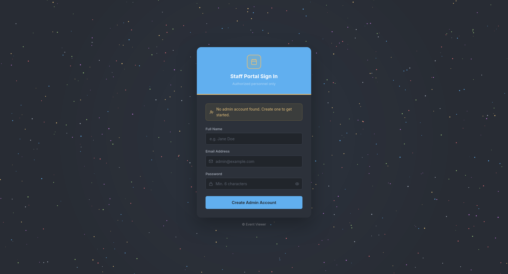
</p>

### 🔐 Login

<p align="center">
  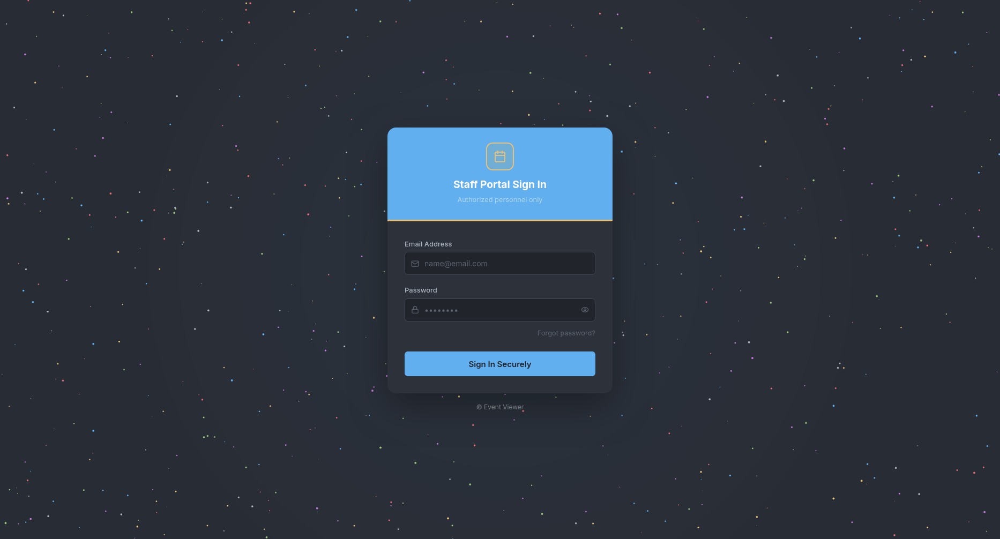
</p>

### 👤 Member Creation

<p align="center">
  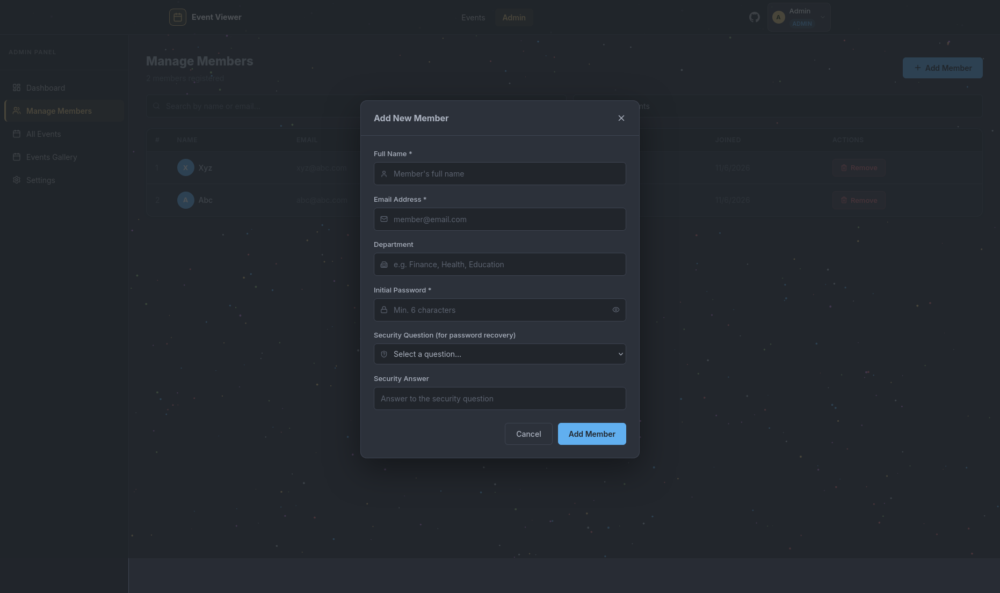
</p>
### 🎪 Event Creation

<p align="center">
  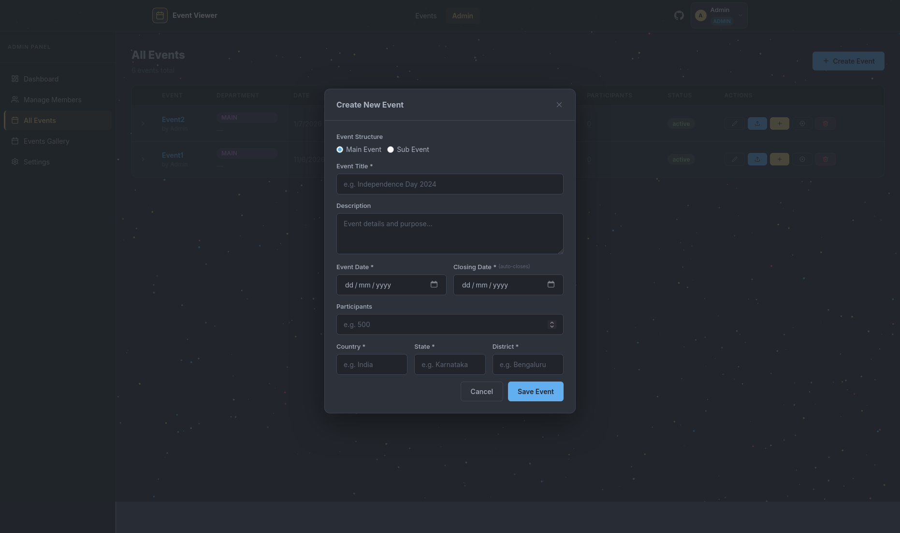
</p>

### 🎪 Sub Event Creation

<p align="center">
  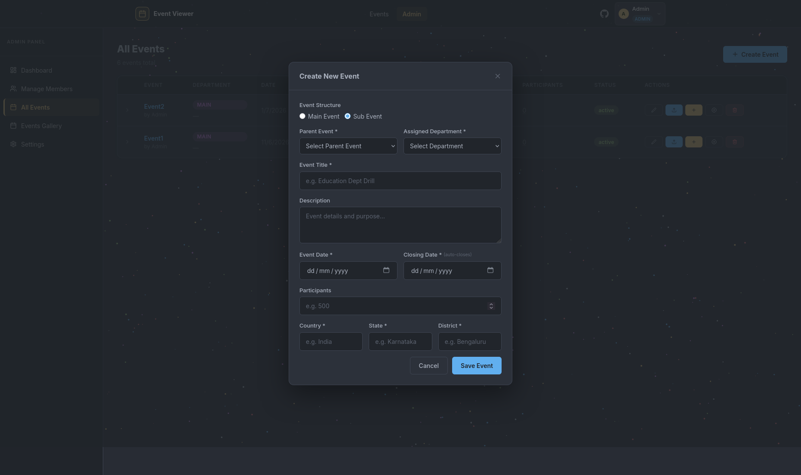
  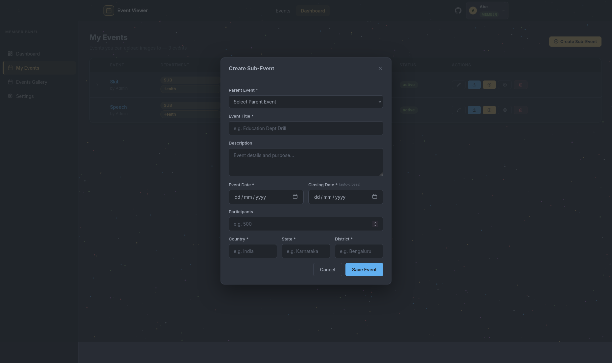
</p>

### 📂 Drill Down View

<p align="center">
  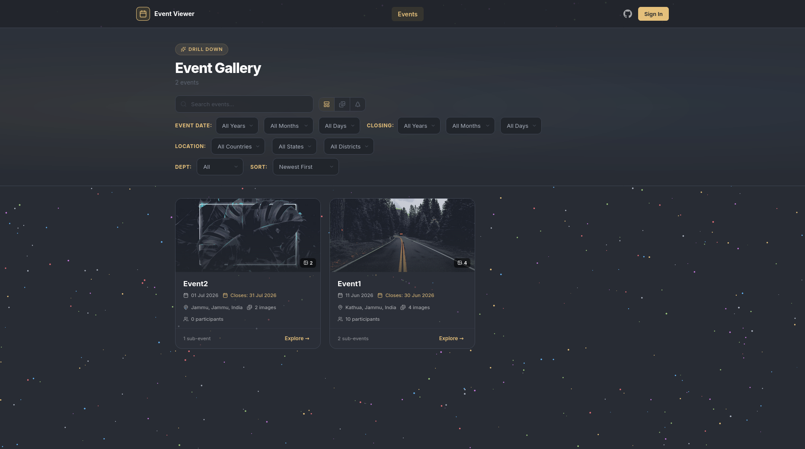
  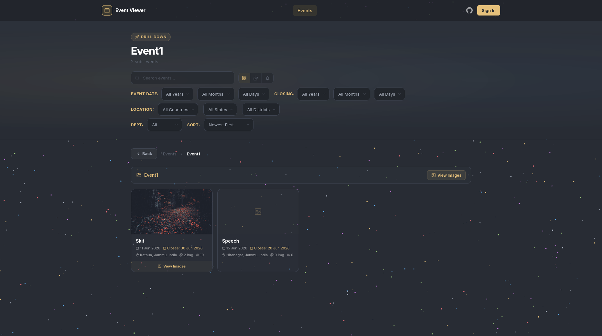
  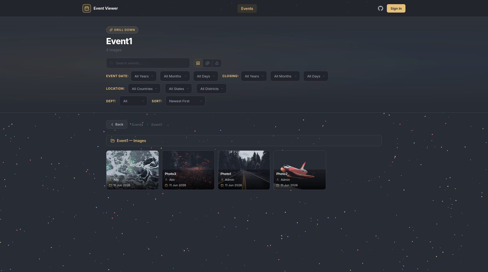
</p>

### 🖼️ Images View

<p align="center">
  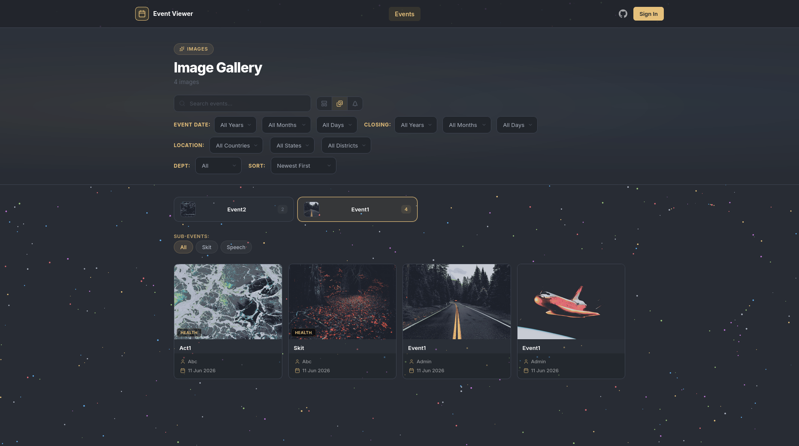
  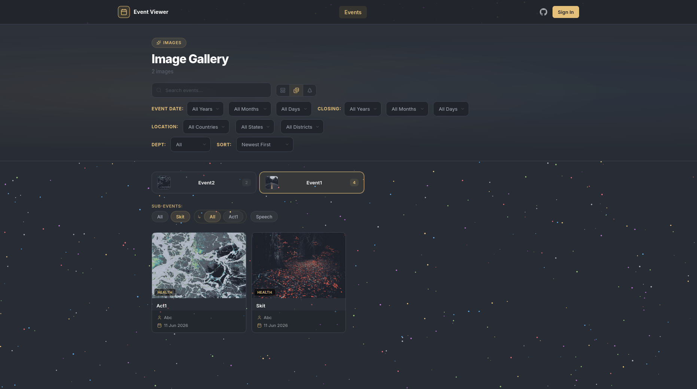
</p>

### 🌳 Tree View

<p align="center">
  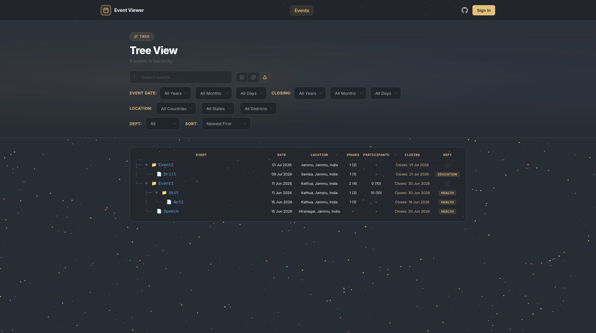
</p>

### 🎬 Demo Video

[results/video.mp4](results/video.mp4)

## 🔮 Future Roadmap

> Cleaner UI and better UX.

## 👤 Author

[](mailto:akshatjasrotia85@gmail.com)
[](https://youtube.com/@akshatjasrotia)
[](https://https://github.com/akshat-jasrotia)
